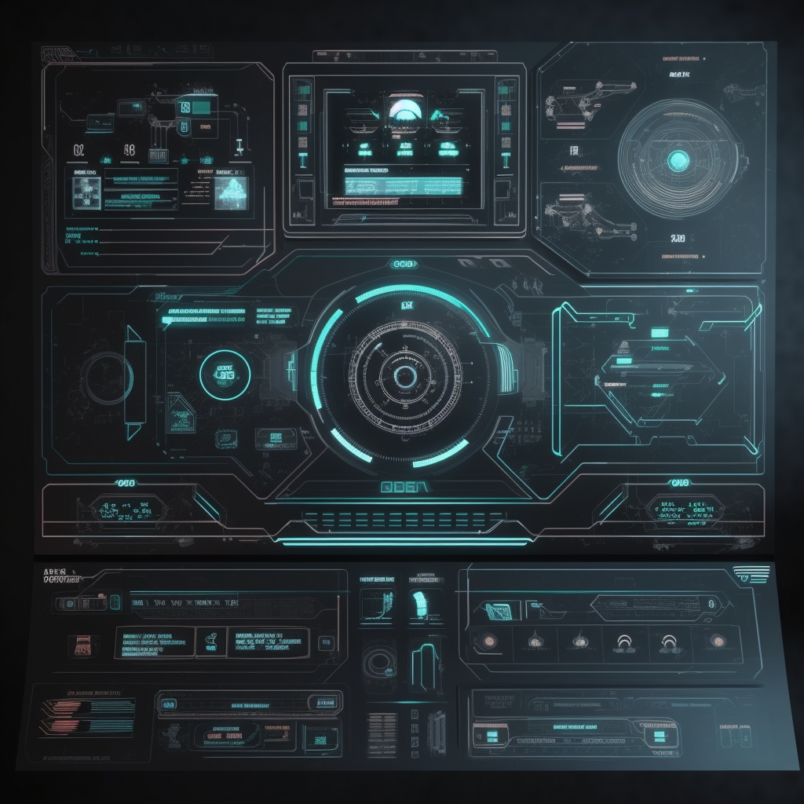

# tacticaloverlay
 AI-powered heads-up display and tactical overlay for the desktop.

# Sci-Fi Interface with Multimodal Large Language Models

The current generation of multimodal Large Language Models with image processing capabilities will allow for the sci-fi interface of your dreams. Despite the fact that the APIs for these tools aren't actually available quite yet (as of 5/10/2023, anyway) I figured I would start putting a framework in place to take advantage of those capabilities when they arrive.

